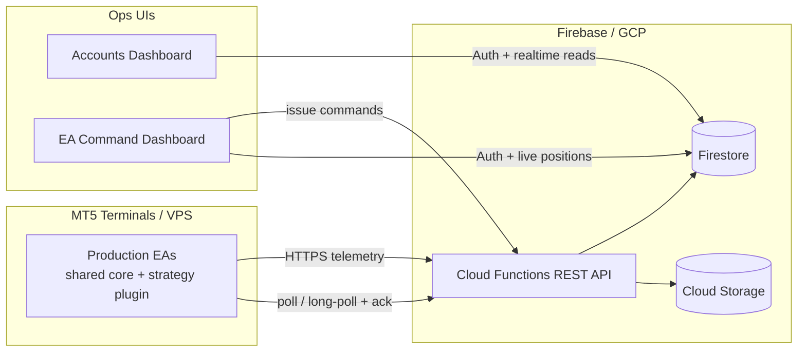

# Persistent Capital — Trading Operations Platform (Showcase)

Modular MetaTrader 5 Expert Advisor core + Firebase cloud telemetry + Angular ops dashboards.

This repository demonstrates **software architecture and engineering practice**, not proprietary trading strategies. Signal logic, parameter calibrations, and alpha-generating rules are intentionally omitted.

Snippets under [`snippets/`](./snippets) are **illustrative only** — they are not a working product checkout.

---

## What this system is

A multi-account trading operations stack:

1. **MT5 Expert Advisors** share a common core (`Master_Files`) and plug in strategy modules.
2. **Cloud Functions** ingest trade lifecycle events, settings snapshots, violations, and chart screenshots into Firestore / Storage.
3. **Angular dashboards** provide realtime account oversight, trade journaling, analytics, and remote EA control.
4. **Command transport** lets operators pause, resume, hibernate, or flatten exposure across charts with acknowledge + dedupe.

All EAs in production share the same platform core, with strategy logic plugged in as modules.

---

## Architecture

See [ARCHITECTURE.md](./ARCHITECTURE.md) for a deeper walkthrough.

### Design principles

| Principle | How it shows up |
|-----------|-----------------|
| Core vs strategy split | Shared `Master_Files` engine; strategy folders only own setup/monitor/adapters |
| Compile-time feature modules | `#define` gates for Grid, Sessions, News, Firestore, License, TradeDayRules |
| Defense in depth | Trading-allowed gate → account violation aggregator → broker-aware order/position helpers |
| Multi-chart safety | Terminal `GlobalVariable` locks for pause, day P/L, exposure, command dedupe |
| Non-blocking cloud ops | HTTP task queue + retries; screenshot morning window; remote command ack |
| Heterogeneous EA UI | Journal **adapter registry** maps each EA to typed display sections |
| Race-safe ingestion | Pending chart-condition outbox when telemetry arrives before parent trade docs |

---

## Stack

| Layer | Tech |
|-------|------|
| Terminal | MQL5 Expert Advisors (shared core + strategy plugins) |
| Backend | Firebase Functions (Node/Express), Firestore, Cloud Storage |
| Command API | Durable per-account command queue (poll + lease/ack evolution) |
| Accounts UI | Angular + AngularFire + Chart.js |
| EA Ops UI | Angular (standalone/signals) + Firestore listeners |

---

## Platform capabilities

### EA core

- Account gatekeeping (equity/balance windows, session/weekday constraints, multi-chart locks)
- Event-driven trade sync (`OnTrade` → internal position state)
- Order/position façades with broker freeze-zone / stop-level awareness
- Economic calendar blackout windows
- Session clocks (Asia / London / NY)
- **Compliance rules** as a modular surface (day rules, consistency checks, trade-window constraints)
- Remote ops: `PAUSE_EA`, `RESUME_EA`, hibernation, close-all, day shutdown

### Cloud

- Trade lifecycle documents (orders, positions, modifications)
- Per-EA settings + condition snapshot routes
- Violation reporting
- Chart screenshot upload pipeline
- Scheduled cleanup of expired pending telemetry

### Dashboards

- Multi-account selection (single account or ALL)
- Live position / activity views
- Trading journal with lazy-loaded lifecycle detail
- Attention feed (violations + derived ops signals)
- Remote command issuance from the EA dashboard

---

## Code highlights

Sanitized excerpts live under [`snippets/`](./snippets).

| Area | What to look at |
|------|-----------------|
| MQL5 lifecycle | `snippets/mql5/01-ea-lifecycle-skeleton.mq5` |
| Trading gate | `snippets/mql5/02-trading-allowed-gate.mqh` |
| Remote commands | `snippets/mql5/03-remote-command-loop.mqh` |
| Telemetry queue | `snippets/mql5/04-telemetry-queue-pattern.mqh` |
| Feature modules | `snippets/mql5/05-feature-flags-and-modules.mqh` |
| API mounting | `snippets/cloud/01-api-route-mount.ts` |
| Firestore paths | `snippets/cloud/02-firestore-paths.ts` |
| Race-safe outbox | `snippets/cloud/03-pending-conditions-outbox.ts` |
| Command contracts | `snippets/cloud/04-command-queue-contracts.ts` |
| Journal adapters | `snippets/angular/01-ea-journal-adapter.ts` |
| Adapter registry | `snippets/angular/02-adapter-registry.ts` |
| Multi-account scope | `snippets/angular/03-multi-account-selection.ts` |

---

## Media

Demo media showcasing the ops UI and remote control flow:

- Dashboard overview (accounts + ALL view)
- Trading journal lifecycle expand (settings / conditions / screenshots)
- EA command panel issuing pause/resume
- Short video: EA tick/timer orchestration → journal row appears in the cloud
- Short video: remote `PAUSE_EA` across charts via GlobalVariables + ack

---

## Disclaimer

See [DISCLAIMER.md](./DISCLAIMER.md). Educational / portfolio material only. Not financial advice.
